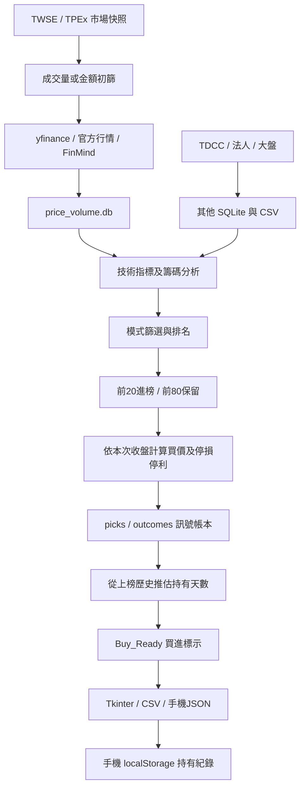
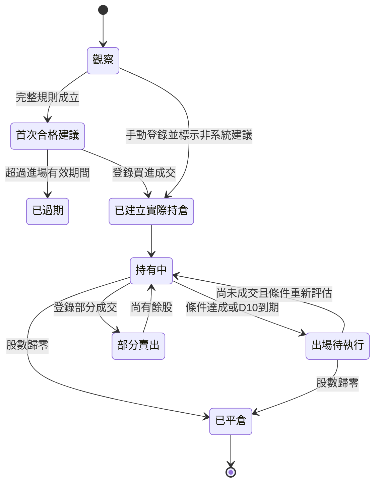

# YenTool 全專案分析、資料庫更新與完整改版方案

> 報告日期：2026-09-09，Asia/Taipei。檢查基準：`f7ea8c6`（2026-08-06）。
> 範圍：核心程式、桌面與手機介面、顯示欄位、資料庫、排程、歷史績效與提高勝率的研究方向。
> 本次交付是改版設計與實際資料更新；尚未將下面的新交易規則或新介面套用到正式程式，也未部署或推送遠端。

## 1. 建議採用的改版方向

YenTool 應從「每天重算的選股清單」，改成「保留首日建議、記錄真實交易、連續追蹤每日損益」的系統。既有 Python 指標、資料抓取與 SQLite 可以繼續使用；需要優先重建的是資料語意、持倉帳本及共用決策流程。

建議將需求定為以下規格：

1. **首次真正符合買進規則時，建立不可被日後掃描覆寫的建議紀錄。** 保存首日建議買價、建議日期、策略版本與當時條件。「第一次被列入觀察清單」不等於「第一次建議買入」。
2. **使用者輸入實際成交日期、價格與股數。** 真實持倉只能由成交紀錄建立；系統推估的隔日開盤价不能冒充使用者成交。
3. **以實際買入日為持倉 D1，追蹤 10 個交易日。** 每個交易日收盤後保存估值與損益；休市不增加天數，漏資料不能假裝休市。
4. **首日建議買價固定，最新評估另外顯示。** 最新觀察買價、目前賣出建議、停損狀態可更新，但不能改寫首日建議或真實成本。
5. **實際績效、建議追蹤績效及回測績效分開。** 沒有買入就沒有實際持倉損益；沒有賣出就不能列為已實現獲利。
6. **股票掉出選股名單，仍持續更新持倉與收盤價。** 這是最重要的可靠性要求之一。
7. **第 10 天產生結算快照與出場提醒，不自動假設成交。** 使用者尚未登錄賣出，持倉就仍存在，D10 成果則固定保留。

預設採「10 個交易日」，符合專案原本 `hold 10 bars` 的定義。首日建議追蹤與實際持倉可以有不同起算日，介面必須各自清楚標示。目前「弱勢時最多延至 20 天」應改成獨立策略選項，不能默默延長使用者要求的 10 天成效統計。

## 2. 現有架構與可以保留的部分

### 2.1 目前主要資料流



問題主要出在 J、K、L、O：當日行情、歷史建議、假設成交和真實持倉沒有形成清楚的資料邊界。

### 2.2 模組盤點

| 範圍 | 現況與判斷 | 改造方向 |
|---|---|---|
| `analyzer/` | 有起漲分、噴發分、蓄勢分、趨勢與支撐壓力；多數是可重用的函式 | 保留計算，補齊欄位定義、版本、輸入有效性 |
| `ingestion/price_volume_multi.py` | 批次抓取與官方備援已有基礎；使用還原價格 | 分離實際交易價格與還原分析價格，保存來源及品質 |
| `ingestion/inst_trades.py` | 最新法人與部分歷史有資料；跨市場更新與缺日判斷不足 | 按市場、交易日檢查覆蓋率，補歷史缺口 |
| `ingestion/tdcc_holders.py`、`tdcc_history.py` | 最新週資料與歷史分級資料都有；兩次快照相減未必真的是一週 | 保存本期與前期日期、發布時間及間隔週數 |
| `scanner/scan_mode.py` | 五個可見模式、額外保留 squeeze 邏輯；只有 prelaunch 有正式 Buy_Ready 規則 | 以策略登錄表管理可交易／觀察／研究狀態 |
| `scanner/holding_tracker.py` | 從訊號帳本推估進出場日期，不是實際交易帳本 | 保留作為模擬追蹤，實際持倉另外建立 |
| `scanner/signal_ledger.py` | picks 與 5／10／20 日結果；不是每日損益紀錄 | 增加不可變建議事件與每日快照；保留旧表作歷史證據 |
| `gui/app.py` | Tkinter 大量介面與規則文字集中在單檔 | 先統一資料契約，再改成共用的響應式介面或薄桌面殼 |
| `mobile/app.js` | 有搜尋、篩選、個股詳情、實際成交價輸入與本機持倉 | 保留互動意圖，重建持倉、表單、狀態及資料同步 |
| `scan_headless.py`、`gui/scan_worker.py` | 同一流程分別維護，容易出現差異 | 抽出同一個掃描服務，GUI／排程僅作入口 |
| `storage/data_store.py` | SQLite 比舊 Excel 適合；批次讀取、WAL、索引已有基礎 | 明確 schema、唯一鍵、真正交易式 upsert、migration |
| `gemini_hook/` | 可選擇 Gemini、Groq、本地摘要 | 只解释後端決策，不再自行重排交易優先順序 |
| `.github/workflows/scan.yml` | 台灣時間 14:30、17:00、18:00 掃描及 Pages 發布 | 排程抓資料與私人持倉儲存分開；補發布與資料新鮮度檢查 |
| `eval_*`、`sandbox_*`、`debug_*` | 累積不少研究，但多份公式、期間與交易方式不同 | 留作實驗紀錄，抽出唯一回測核心及實驗登錄表 |
| `main.py` | 舊 watchlist／FinMind／分點流程，不等同目前主要掃描 | 明確標成 legacy，避免當成正式操作入口 |
| `docs/`、打包規格 | 歷史紀錄豐富，但各版策略敘述、更新時間和打包方式互有落差 | 建立現行規格單一入口，舊結論標示適用版本 |

值得保留的設計：前 20 進榜／前 80 留榜的名單穩定機制、依市場快照筆數偵測資料源異常、批次載入與抓取、獨立研究資料庫、原始訊號帳本與本地摘要備援。它們可以成為改版基礎，但「名單留榜」不能再代表「真的持倉」。

## 3. 已確認的主要問題與優先順序

P0：會直接扭曲交易或績效語意；P1：影響資料可信度、關鍵操作或可靠性；P2：介面清晰度、維護成本與後續擴充。

| 編號 | 優先 | 發現與影響 | 程式依據 | 修正要求 |
|---|---|---|---|---|
| F01 | P0 | prelaunch 的建議買價、停損、停利每次依當日收盤重算；無首日固定建議欄位 | [scan_mode.py](/D:/YenTool/scanner/scan_mode.py:324) | 首日建議快照 immutable；當前評估另存 |
| F02 | P0 | 桌面主表仍顯示當日重算的 `Strict_Stop_Loss`，沒有切換為 `Fill_*`；手機部分卡片已修，兩端不一致 | [app.py](/D:/YenTool/gui/app.py:752)、[app.js](/D:/YenTool/mobile/app.js:301) | 同一筆持倉在所有端使用同一成本與有效風控價 |
| F03 | P0 | `Entry_Open` 是推估日期的市場開盤價，並非真實成交；自動顯示「持有」易讓未買者以為已進場 | [holding_tracker.py](/D:/YenTool/scanner/holding_tracker.py:160) | 模擬追蹤與真實持倉使用不同狀態及名稱 |
| F04 | P0 | 手機持倉價格只向今日 `ALL_ROWS` 查找；掉榜後價格及損益變成空白 | [app.js](/D:/YenTool/mobile/app.js:415) | 行情更新集合至少包含全部未平倉與未完結建議 |
| F05 | P0 | 沒有股數、成交明細、真實賣出與每日損益表；移除持倉會直接刪資料 | [app.js](/D:/YenTool/mobile/app.js:366) | 用成交事件及結算紀錄取代刪除；可保存實現損益 |
| F06 | P0 | Buy_Ready 未檢查個股日期及 Integrity_OK；缺少 holding 狀態會被視為新訊號 | [scan_mode.py](/D:/YenTool/scanner/scan_mode.py:434) | 缺資料、過期、不支援規則均阻擋買進，列明原因 |
| F07 | P0 | 前端再算買進規則，未以策略版本／Buy_Block 為權威；孤立輸入可將後端 `no_rule` 誤判可買 | [app.js](/D:/YenTool/mobile/app.js:187) | 後端唯一決策；前端最多把建議判為過期，不能放寬 |
| F08 | P0 | 還原價與官方未還原價可能混入同一價量表，且沒有來源欄位；不能用調整後歷史開盤價表示當年真實成交價 | [price_volume_multi.py](/D:/YenTool/ingestion/price_volume_multi.py:223) | raw／adjusted／adjustment factor 分存；損益以真實交易與企業行動計算 |
| F09 | P0 | 鎖利模擬說明寫「同日觸發後跌破視為出場」，程式卻下一根才生效；先檢查低價也可能忽略早已在開盤達成的停利 | [signal_ledger.py](/D:/YenTool/scanner/signal_ledger.py:293) | 明確事件順序與日 K 的不確定性，統一回測、畫面與文件 |
| F10 | P1 | 過期股票加 `.stale`，而共用 `.stale` 規則設定 `display:none`；過期卡片可被整張隱藏，而不只是變淡 | [styles.css](/D:/YenTool/mobile/styles.css:62)、[styles.css](/D:/YenTool/mobile/styles.css:252) | 資料提示與股票狀態的 CSS 類名分開；過期持倉必須可見 |
| F11 | P1 | 手機成交價輸入 `abc` 或 0 會因 `num(...) || ref` 默默採用參考價 | [app.js](/D:/YenTool/mobile/app.js:378) | 拒絕無效輸入；不把猜測值寫成真實成交 |
| F12 | P1 | 買入日期自動取訊號推估日，使用者不能編輯；一股只能存一筆，不能記多次交易 | [app.js](/D:/YenTool/mobile/app.js:390) | 明確成交日期、股數、成交價及獨立 position/trade ID |
| F13 | P1 | holding tracker 使用第一列 Data_Date 當全表今天；最多容忍 10 交易日缺席還視為同一上榜段 | [holding_tracker.py](/D:/YenTool/scanner/holding_tracker.py:193) | 每筆事件有自己的日期；交易週期用 ID，不靠上榜間隔猜測 |
| F14 | P1 | 手機用週一至五推算未來交易日，還可能把「沒有資料」推斷成休市；時區取裝置當地時間 | [app.js](/D:/YenTool/mobile/app.js:106) | 官方市場日曆、臨時停市狀態、Asia/Taipei 與資料狀態分開 |
| F15 | P1 | 大盤只檢查有無 60 筆，未回傳資料日期／新鮮度；舊大盤也可能顯示順風 | [market_regime.py](/D:/YenTool/scanner/market_regime.py:13) | 回傳 `as_of_date` 與 `is_current`，與個股資料同一時點 |
| F16 | P1 | 法人用整表最大日期決定是否更新；一個市場成功可阻止另一市場補齊。「5 日」實際可能只是最近 5 筆、不連續 | [inst_trades.py](/D:/YenTool/ingestion/inst_trades.py:141) | 按市場、股票、應有交易日驗證；顯示有效日數與缺日 |
| F17 | P1 | 當日重掃先刪 picks，並非嚴格 append-only；未保存 Core_Plus、Buy_Ready、完整閘門與規則版本 | [signal_ledger.py](/D:/YenTool/scanner/signal_ledger.py:133) | 掃描批次可重跑；對外首日建議只追加事件／修正版本 |
| F18 | P1 | 空結果不輸出新 CSV／JSON，headless 空名單 exit 1；健康的 0 檔日可能留下昨天畫面 | [result_export.py](/D:/YenTool/scanner/result_export.py:18)、[scan_headless.py](/D:/YenTool/scan_headless.py:138) | 正常空名單也發布 count=0、日期及品質；與執行失敗區分 |
| F19 | P1 | 目前 outcomes 只在完整 5／10／20 日後寫入，無法回答 D1 到 D10 的逐日累計損益 | [signal_ledger.py](/D:/YenTool/scanner/signal_ledger.py:352) | 每個交易日獨立 valuation snapshot，完整期績效另算 |
| F20 | P1 | 手機的 cache key 帶每次不同的 `?t=`，Service Worker 卻按完整 URL 尋找離線快取 | [sw.js](/D:/YenTool/mobile/sw.js:30) | 行情快取使用固定資源鍵，辨識離線／舊版，不無限累積 |
| F21 | P1 | 桌面大盤文案「新倉減半／正常」與真正不准開新倉的規則不一致；降級資料未完整傳入桌面 UI | [app.py](/D:/YenTool/gui/app.py:667)、[scan_worker.py](/D:/YenTool/gui/scan_worker.py:50) | 文案從同一決策狀態產生；禁止同畫面相互矛盾 |
| F22 | P2 | 主表顯示 Launch，桌面上色看 Surge，手機上色看 Explosion；不同分数被當成同一強度 | [app.py](/D:/YenTool/gui/app.py:780)、[app.js](/D:/YenTool/mobile/app.js:77) | 依策略顯示主分數；交易狀態顏色與技術分數分開 |
| F23 | P2 | AI 說明仍把量縮定義成今日／20 日，但實作是近 3 日均量／20 日；未帶入完整買進閘門與持倉成本 | [prompt_builder.py](/D:/YenTool/gemini_hook/prompt_builder.py:7) | 輸入權威結構化決策；明示只摘要前 10 檔與當前篩選范围 |
| F24 | P2 | requests timeout／連線例外不一定轉成 AIReportError，可能跳過預期備援；AI 又在行情發布前執行 | [gemini_client.py](/D:/YenTool/gemini_hook/gemini_client.py:155)、[scan_headless.py](/D:/YenTool/scan_headless.py:117) | 先發布行情與持倉，再異步補摘要；統一處理网络例外 |
| F25 | P2 | SQLite `DELETE` 加 pandas `to_sql` 不應只憑外層 `with` 就宣稱多股票整批原子寫入；缺 schema 版本及多數唯一約束 | [data_store.py](/D:/YenTool/storage/data_store.py:194) | 明確交易與 native upsert，失敗時驗證回滾及資料保留 |
| F26 | P2 | 套件只設最低版本；本機與 CI Python 版本不同；spec 一份有模式 JSON、一份沒有 | [requirements.txt](/D:/YenTool/requirements.txt)、[TaiwanScanner.spec](/D:/YenTool/TaiwanScanner.spec) | 固定可重現環境、单一打包入口及可寫資料目錄 |

F10 是 CSS 與產生的 HTML 類別交叉檢查的結果；本次沒有以真實裝置截圖宣稱完成視覺驗收。其餘程式問題的最小重現見第 15 節。

對 F25，pandas 官方文件也明示：使用原生 `sqlite3.Connection` 時，`to_sql` 的插入不能依一般預期回滾。因此資金與成交帳本應用明確、可測試的交易寫入方式。[pandas to_sql 文件](https://pandas.pydata.org/docs/reference/api/pandas.DataFrame.to_sql.html)

## 4. 資料庫現況、更新結果與保留限制

### 4.1 更新前實際量測

| 資料 | 更新前筆數 | 更新前日期狀態 | 判斷 |
|---|---:|---|---|
| `price_volume.db / data` | 169,593 | 646 檔；2025-05-12～2026-07-09 | 本機行情落後；與較新訊號帳本不同步 |
| `research_prices.db / data` | 2,800,165 | 2020-03-25～2026-06-25 | 多年研究資料需補齊近期 |
| `signal_ledger.db / picks` | 1,405 | 2026-06-25～2026-08-06 | 比本機價量新；不能假設同一完整快照 |
| `signal_ledger.db / outcomes` | 2,653 | 表內尚無 `rule_*` 欄位 | 程式已升級，資料 schema 尚未跟進 |
| `inst_trades.db / data` | 124,214 | 最新 2026-07-09 | 跨日期覆蓋不完整，7/2 只有 818 筆 |
| `large_holder.db / data` | 15,982 | 最新 2026-07-03 | 週資料落後 |
| `tdcc_history.db / levels` | 502,415 | 2025-07-18～2026-07-09 | 分級歷史與最新摘要更新機制不同 |
| `taiex.db / TAIEX` | 268 | 最新 2026-07-09 | 不足以代表檢查當日大盤 |
| `mobile/scan_result.json` | 36 檔 | 掃描 2026-07-10；行情 2026-07-09 | 舊 JSON 缺新程式所需 Entry_Open／Fill_*／Buy_Ready 欄位 |

上述是 **本機工作區** 的量測，不能直接推論雲端 Pages 或使用者手機也停在同一日期。

### 4.2 本次實際更新

<!-- DATABASE_UPDATE_RESULT -->

### 4.3 必须保留的資料品質區分

- 「抓取成功」只代表來源回傳資料，還要檢查每檔最新交易日、OHLC 邏輯、交易日缺口與市場覆蓋率。
- 缺日、停牌、沒有成交、資料源失敗、公司除權息是不同事件；不能全部補前日價格，也不能全部當作休市。
- 被隔離的異常原始 K 線保留在稽核檔，更新前完整 DB 另有備份。隔離後的缺口仍需追查，不能把刪掉異常值稱為完整修復。
- 歷史回測遇到缺少行情的交易日，要維持真實日曆並排除無法結算的樣本，不能把下一筆觀測當成下一個市場交易日。
- 多年研究庫、400 日掃描快取、真實成交及首日建議的保存期限應分開；真實成交／建議／結算不可隨 400 日行情裁切。

## 5. 固定首日買價、更新賣出建議的完整規格

### 5.1 四種價格不能混為一欄

| 名稱 | 建議欄位 | 何時建立 | 後續是否改動 |
|---|---|---|---|
| 首日建議買價 | `initial_recommended_buy_price` | 第一次通過完整買進規則、正式產生建議時 | 固定，資料更正另留修訂事件 |
| 最新買入評估參考 | `latest_entry_reference` | 最新有效行情重新評估時 | 可更新，過期或已持有時不當成新的買進指令 |
| 實際成交價／平均成本 | `execution_price`／`average_cost` | 使用者登錄每筆成交時 | 成交本身不可被掃描改寫；補登或更正要有版本 |
| 當前有效賣出規則 | `active_stop_price`、`target_price`、`exit_action` | 成交後依該策略版本初始化，之後由事件更新 | 可依明確規則更新，保留更新理由及生效時間 |

固定首日價格並不等於保證一定買得到該價，也不等於一定要把它當限價掛單。現行 prelaunch 用訊號日收盤作參考、以隔日開盤價作回測進場；若改為「只有回到首日固定價才買」，那是新的限價進場策略，必須單獨回測成交率、漏接上漲標的與淨報酬。

另須修正文案「隔日開盤市價進場」：回測的「以開盤價成交假設」與交易所接受的委託種類不是同一件事。上市開盤集合競價僅接受限價 ROD；上櫃集合交易亦須遵循相應委託規則。畫面應寫「隔日開盤進場計畫／實際依券商成交回報」，不保證開盤價成交。[TWSE 交易制度](https://www.twse.com.tw/zh/products/system/trading.html)、[TPEx 逐筆交易說明](https://www.tpex.org.tw/zh-tw/mainboard/trading/rules/continuous.html)

### 5.2 建議與持倉分成兩條生命週期



資料狀態另外管理：`current`、`awaiting_close`、`stale`、`missing`、`suspended`、`invalid`。不要用同一個 Hold_Status 同時表示市場資料品質、策略狀態與實際持倉。

交易條件沒有成交回報前，只能產生提醒／假設成交，不得直接跳成真實「已平倉」。已平倉不可因隔天大盤轉弱又變成延後持有。出場條件達成的歷史事件即使後來取消，也要保存。

### 5.3 D0、D1、D10 的一致定義

| 時点 | 建議追蹤 | 實際持倉 |
|---|---|---|
| D0 盤後 | 首次符合買進規則；固定首日建議與參數 | 尚未買入，不計實際損益 |
| 下一個交易日 | 可進入預先定义的模擬進場；原建議仍固定 | 使用者實際成交，該成交交易日為持倉 D1 |
| D1 收盤 | 保存建議追蹤用的基準績效 | 保存實際成本、剩餘股數、收盤價、當日及累計損益 |
| D2～D9 收盤 | 持續追蹤原 recommendation_id | 無論是否留在榜上，都更新同一 position_id |
| D10 收盤 | 保存固定十日成效，不再漂移 | 保存十日快照；若仍持有，標示已達第 10 日、待登錄出場 |
| D11 以後 | 十日成果維持不變，可另外檢視延伸績效 | 尚有持股就繼續估值；不可刪除或凍結其真實風險 |

若實際晚兩天才買，真實持倉 D1 也晚兩天；首日建議追蹤不跟著重設。若 D4 就全數賣出，D4 後不再承受行情損益，D10 回顧顯示該筆已實現結果及提前結束原因。

同一檔再次推薦，必須有新的 recommendation_id 與週期條件。預設同一策略已有未平倉部位時，不另開一個自動買進週期；手動加碼另列成交及調整後成本。不能以 `stock_id` 當整個帳戶的唯一交易主鍵。

### 5.4 賣出建議怎樣更新才合理

保留目前參數作「舊策略版本」的規格描述：初始停損是成交成本的 -15%、獲利 +6% 啟動鎖利至 +2%、目標 +20%。這些數字是否仍適合，須由後面的新資料研究判斷；本報告不把它們當成已證明最優值。

推薦的資料與決策設計：

- 初始停損、停利目標及啟動門檻從真實成本計算，保存於該筆持倉的策略快照。
- 保存 `trail_armed_at`、`highest_price_since_entry`、`previous_stop`、`active_stop`、`effective_from`、`reason_code`。
- 同一策略、同一持倉的保護價若採只上調規則，市場下跌不得重新以較低收盤計算而放寬停損。
- 「尚未啟動鎖利」及「已啟動鎖利」必須明顯不同；顯示 +2% 這個數字不代表已經保住該獲利。
- 不要只有一個「建議賣價」。最少應有：建議動作、有效停損／鎖利價、停利目標、理由、判定資料時間及生效時段。
- 第 10 天是否延長，必須寫進策略版本。即使開啟延長，D10 的十日績效仍然固定保存。

**收盤更新與盤中出場需分清楚：** 本次優先完成每日收盤損益。若只取得盤後資料，就只能盤後判斷「當日曾觸及條件」或產生下一交易日計畫；不能補寫成使用者已在盤中成交。若將來要求真的盤中即時提醒，需要另接合法即時行情及穩定執行服務，屬獨立階段。

最容易執行的初版是：每日盤後更新收盤績效，提供下一日有效的賣出計畫；真實賣出以使用者回報成交價結算。盤中停損／鎖利模擬仍可在研究頁展示，但要標示成交假設。

## 6. 十日累計損益：公式與顯示方式

### 6.1 單一買入、尚未賣出

設首日建議價為 S、實際買入價為 B、股數為 Q、第 t 個交易日的官方未還原收盤價為 C_t。

```text
建議追蹤價差報酬_t = C_t / S - 1
實際持倉價差損益_t = (C_t - B) × Q
實際持倉價差報酬_t = C_t / B - 1
當日損益_D1 = (C_1 - B) × Q
當日損益_t = (C_t - C_(t-1)) × Q       （t >= 2；股數不變時）
十日累計價差損益 = (C_10 - B) × Q
```

若建議策略評估採「隔日模擬開盤價」，分母應改成獨立保存的 `simulated_entry_price`，名称改成「模擬策略績效」；不能一會儿用 S，一會兒用開盤價卻都叫訊號後損益。

**不能把 D1、D2……D10 各日的「自買進起累計報酬」再加總。** 這會重複計算已經包含在前一天的獲利。正確方式是保存每一天的累計值，D10 取第十天那一筆。

### 6.2 可核算的十日示例

假設首日建議價 100 元、實際成交 102 元、買入 1,000 股，以下先不含費稅。

| 持倉日 | 收盤價 | 當日損益 | 自買入起累計損益 | 實際價差報酬 |
|---|---:|---:|---:|---:|
| D1 | 103 | +1,000 | +1,000 | +0.98% |
| D2 | 101 | -2,000 | -1,000 | -0.98% |
| D3 | 105 | +4,000 | +3,000 | +2.94% |
| D4 | 106 | +1,000 | +4,000 | +3.92% |
| D5 | 104 | -2,000 | +2,000 | +1.96% |
| D6 | 108 | +4,000 | +6,000 | +5.88% |
| D7 | 107 | -1,000 | +5,000 | +4.90% |
| D8 | 110 | +3,000 | +8,000 | +7.84% |
| D9 | 109 | -1,000 | +7,000 | +6.86% |
| D10 | 112 | +3,000 | +10,000 | +9.80% |

十日損益是 **+10,000 元**；相對首日建議價的價差報酬是 **+12%**，相對真實成本則是 **+9.80%**。這兩個答案都可能正確，但不能使用同一標題。

### 6.3 費稅、部分賣出與真正總損益

建議用股為內部数量單位，前端可輸入「張／股」並立即顯示換算。一般股票 1 張為 1,000 股，但商品主檔仍應保存各商品的交易單位，不能在所有商品寫死。[TWSE 交易單位](https://www.twse.com.tw/zh/products/system/trading.html)

```text
部位帳面成本 = 各買入成交金額 + 已分攤的買入費用
已實現淨損益 = 各次賣出金額 - 實際賣出費用與稅 - 該次移除的帳面成本
未實現帳面損益_t = 剩餘股數 × C_t - 剩餘帳面成本
截至今日帳面總損益_t = 已實現淨損益 + 未實現帳面損益_t + 已認列淨配息
若今日全數賣出之估計淨損益_t = 帳面總損益_t - 剩餘持股的預估賣出費稅
```

買入費用只計一次；部分賣出時按已選定的成本法分攤。初版建議帳戶內固定使用移動加權平均法，與券商對帳若不同須明確展示差異。`gross`、`net_book`、`net_if_liquidated` 三種結果不可共用模糊的「總獲利」標籤。

手續費率、最低費用及折讓依使用者券商設定；不能把 0.1425% 當所有人的固定實際費率。股票一般賣出證交稅目前為賣出價金 0.3%，商品／當沖等例外應由版本化費稅表決定。[TWSE 手續費與交易稅](https://www.twse.com.tw/zh/about/company/guide.html)、[營業細則第94條](https://twse-regulation.twse.com.tw/TW/law/DOC01.aspx?FLCODE=FL007304&FLNO=94)

用上述 D10 例子，只作計算示範，若買賣手續費各假設 0.1425%、一般股票賣出稅 0.3%，且暫不考慮券商元位取整：買入費 145.35、賣出費 159.60、賣出稅 336.00，估計净獲利為 **9,359.05 元**；以買入金額加買入費為分母，淨報酬約 **9.16%**。未賣出時仍須標成「估計」。

有部分買賣、現金股利或更正時，每日損益不能再只用「收盤價差 × 今日股數」。應由每日總損益快照的差額及交易事件推導，並區分績效修訂與當日市場損益。

### 6.4 多檔總覽

- 金額可以加總：把同一估值日、同一帳戶所有部位的淨損益相加。
- 百分比不能直接加總或用未加權平均冒充帳戶報酬。
- 靜態同批投入可用總損益／總投入成本；有進出資金的帳戶，另計時間加權報酬或 XIRR，展示採用的方法。
- 若不同持倉的估值日期不同，總覽顯示「估值不完整」，並列出哪些股票仍沿用較早價格。
- 資金曲線的最大回撤須從含現金、持倉與出入金處理的淨值序列計算；「最差單筆報酬」不是帳戶最大回撤。

## 7. 介面改版：先回答使用者要做什麼

### 7.1 建議的五個主要頁面

| 頁面 | 要回答的問題 | 核心內容 |
|---|---|---|
| 今日總覽 | 今天要注意什麼？ | 資料日期、持倉損益、今日待處理、即將到期、新建議數 |
| 今日建議 | 哪些是新的有效建議？ | 首次建議時間、固定買價、有效期限、買進條件、風險、登錄買入 |
| 我的持倉 | 我實際買了什麼、目前賺賠多少？ | 真實成本與股數、收盤價、D幾、損益、有效賣出計畫 |
| 績效與歷史 | 十天結果如何、過去交易是否真的有效？ | 十日曲線、已實現／未實現、已平倉、建議與實際差異 |
| 研究與資料狀態 | 為什麼選它、數據可信嗎？ | 指標詳情、策略版本、回測條件、來源覆蓋、失敗及待補資料 |

桌面與手機應共用同一資料契約與規則。優先做響應式 Web／PWA；既有 Tkinter 可在遷移期保留入口，避免長期維護兩套獨立決策實作。

### 7.2 今日總覽示意

```text
YenTool                         行情截至：2026-09-09 收盤
資料完整度：待補 2 檔            最近成功更新：18:06

帳面總損益        今日損益          已實現淨損益
+12,350 元        -1,200 元         +4,300 元

[待處理 3]  [今日新建議 2]  [持倉 5]  [D10到期 1]

待處理
• A 股票：第10交易日已到，尚未登錄賣出
• B 股票：資料缺漏，損益仍以9/8收盤估值
• C 股票：鎖利條件已成立，查看下個交易日計畫
```

這是介面規格示例，數字不是本次真實帳戶資料。

### 7.3 手機持倉卡片示意

```text
股票名稱／代號        持有中 · D4 / 10

累計損益 +4,000 元    +3.92%（未扣未來賣出費稅）
今日損益 +1,000 元    估值：9/9 收盤

實際成本 102.00      持有 1,000 股
最新收盤 106.00      首日建議 100.00 [固定]
有效停損 86.70       停利目標 122.40

鎖利：尚未啟動；啟動門檻 108.12
建議：續抱，下一個交易日重新評估

[登錄賣出] [補登／更正成交] [十日明細]
```

價格示例僅為公式展示；实际可掛單價須再依股票升降單位換算。

### 7.4 現有畫面具體修改

- 桌面主表新增「狀態、資料日期、持倉天數、實際成本、剩餘股數、累計淨損益、建議動作」；技術指標移至詳情。
- 「進場參考」改成明確的「首日建議價」或「最新觀察參考」，不要同名卻不同基準。
- 「現價」改成「最新收盤價」，旁邊顯示該檔日期。盤中即時價若未來加入，另列欄位。
- 「出場／移除」拆成「登錄賣出」、「封存已結束紀錄」及「撤銷誤登」，各有不同資料行為。
- 新增完整買入表單：成交日期／時間、成交價、股數、手續費、關聯建議及備註；可編輯、可取消、保存前顯示總投入金額。
- 手機主畫面以兩欄資訊格呈現，四欄技術小字移至詳情；常用按鈕與文字需適合觸控。
- 頂部長策略說明改成摘要與可展開說明，避免固定頁首佔去大半個手機畫面。
- 到期／資料異常／需登錄成交的持倉置頂，不能因分數低或掉榜而消失。
- 使用者排序或篩選只改畫面次序，不改原始推薦排名與首日入場資格。
- 不只依賴紅綠判斷盈虧；同時顯示正負號與文字。漲跌配色可選台股慣例，與「資料正常／錯誤」的狀態顏色分開。
- 載入失敗保留上次資料但清楚標日期；重刷成功卻是零建議，也要顯示當天的正常空結果。

## 8. 顯示欄位的合理性與正確性盤點

| 現有欄位／群組 | 正確含義或問題 | 建議調整 |
|---|---|---|
| Stock_ID、Stock_Name、Market | 基本識別；市場分類不能只靠股票代號字數猜 | 保留並加 instrument_type、市場有效期間 |
| Data_Date、Scan_Time | 個股行情日期與執行時間不同 | 同時顯示；另加發布時間、來源日期及快取狀態 |
| Close_Price | 本次分析序列的最新收盤；來源可能為還原序列 | 改以 raw_close 顯示可對帳收盤，adjusted_close 僅分析用 |
| Suggested_Buy_Price | 目前是每次計算的參考價，不是固定建議 | 拆首日建議、最新評估及模擬進場假設 |
| Strict_Stop_Loss、Target_Price | 未成交時來自參考價，已成交時仍可能被重算 | 分 reference_* 與 position_*；「Strict」不能表示保證成交 |
| Trail_Arm_Price、Trail_Lock_Price | 門檻數字不代表鎖利已啟動 | 加啟動狀態、日期、有效期及判斷依據 |
| Entry_Open、Fill_* | 訊號推估進場日的市場價与衍生水位 | 重新命名 simulated_*，不可默認成使用者成交 |
| Risk_Pct | 價格到停損的距離，不是虧損機率或帳戶風險 | 改「停損距離%」；加部位最大計畫損失及占帳戶比例 |
| Entry_Date、Exit_Date | 目前是推估交易日，有時未來日期空白 | 分實際成交日、計畫出場日、實際平倉日 |
| Hold_Day／Remaining／Total／Cap | 目前是模擬上榜週期；實際未必有買 | 真實持倉與建議追蹤各有 day_index；標交易日 |
| Hold_Status、Hold_Note | 混入推估持倉、過期與大盤延後 | 從事件狀態產生；不由前端當地日期猜測 |
| Buy_Ready、Buy_Block、Core_Plus | Core_Plus 只是品質條件的一部分 | 主畫面顯示完整資格與不成立原因；未知不能當通過 |
| Launch_Score | prelaunch 主分數，0～100 的規則分數 | 稱「起漲條件分」，不是上漲機率；可展開分項 |
| Surge_Score | 已有動能與波動特徵的綜合分數 | 稱「動能分」，與起漲條件分分開 |
| Explosion_Score | 箱型壓缩、量縮及上漲日成交量偏多的分數 | 稱「盤整蓄勢分」；不可直接宣稱爆發概率 |
| ATR_Pct | 實作為20日平均 `(high-low)/close`，不包含前收跳空的 True Range | 先更名「20日平均日振幅%」；若真正改 ATR，另建新欄位及版本 |
| Ret_5D_Pct、Gain_1M_Pct、Gain_3M_Pct | 約5／20／63個交易日的歷史價差漲跌 | 明示期間；不是未來預期報酬 |
| Dist_52W_High_Pct、Near_52W_High | 實作比較252筆區間的「收盤最高」，最少240筆 | 更名「距近一年最高收盤」；不能當盤中歷史最高 |
| RS_Score、RS_Strong | 與TAIEX對齊日期後，63日報酬相減 | 單位為百分點；標示相對哪個指數及資料日期 |
| Foreign_Net、Trust_Net | 每日法人買賣超，單位張 | 顯示來源日；零、未取得及未公布須區分 |
| Foreign_Net_5D、Inst_Buy_Days | 最近5筆法人資料，未保證涵蓋連續5交易日 | 顯示有效日數、起迄日及缺日；完整才叫5日累計 |
| Large_Holder_Pct、Retail_Pct | TDCC級距彙總；大戶由400,001股以上區間起算 | 名稱寫精確級距；不是「主力」或內部人持股 |
| Large_Pct_Change、Retail_Pct_Change | 两次可得快照的持股比例相減 | 單位「百分點」；附兩期日期，隔兩月不能叫週增減 |
| Cond_A／Cond_A_5D | 盤整與量縮條件；當日和最近5筆成立過不同 | 顯示當日／近期，附最近觸發日期 |
| Cond_B | 当前TDCC版本是一期間大戶持股上升，舊說明有多週／付費版本 | 以版本化定義描述；補 available／as_of |
| Cond_C、Volume_Bias | 上漲日成交量占上漲＋下跌日成交量的比例 | 改「上漲日量能占比」，不能直接當真實主力吸籌證據 |
| Is_Golden_Signal／Is_Breakout_Signal | 不同入口近期窗口、量能基準有差異 | 統一交易日窗口及排除當日的量能基準 |
| Volume_Dryup | 近3日均量／20日均量 | 修正AI、手冊與tooltip；不要寫成當日量縮比 |
| Range_Tightness | 20日最高價與最低價的區間寬度比例 | 顯示百分比，或明確标「比值」 |
| MA5／10／20／60、MA_Bull_Align | 均線數值與多頭排列 | 保留作原因與詳情，不擠滿主操作頁 |
| MA_Squeeze | 均線聚攏；程式與註解對「在所有均線之上」定義不完全相同 | 明確寫出條件並共用一份測試 |
| Donchian_Break | 壓縮區間且收盤接近前40日高的97%，不一定真的突破 | 更名「通道上緣接近／突破」，實際突破另列旗標 |
| MACD_Cross／Hist_Turn、Trend_Breakout | 輔助技術條件，不是買進保證 | 詳情保留、附觸發日期及算法版本 |
| Support_Used、Support_20L／60L | 最近支撐候選与區間低點，並非保證不跌破 | 保留；勿與實際停損價混用 |
| Resist_60H | 當前取最近60筆再排除今日，實際至多59筆高價 | 明確採「前60交易日高」或據實更名，修正 off-by-one |
| Sup_Gap_Pct／Res_Gap_Pct | 現有兩欄分母不同：支撐作分母、收盤作分母 | 統一分母或明示公式；負壓力距離顯示已突破 |
| Gap_Up_Sup／Gap_Dn_Res | 最近出現的跳空，不保證仍未回補 | 顯示日期、回補狀態，移除過期缺口的操作暗示 |
| VP_Zone1～3 | 把每日收盤價分箱、累積整日量的近似值 | 更名「收盤價量分布區」；不是逐筆成交量分布或真实主力成本 |
| Round_Level、Squeeze | 輔助價位與相對支撐壓力條件 | 詳情使用；不得直接取代實際出場紀錄 |
| Vol_MA20／5／Today、High_20_Prev、High／Low_Today、Close_Prev、Min_Price_3 | 計算中間值，多數不需在主列表顯示 | 放進診斷與規則詳情；定義是否包含當日 |
| Integrity_OK／Flags／Recent_Jump | 已計算，卻沒有完整接上可交易資格與畫面 | 提升為必要品質欄位，區分錯誤、警告與企業行動 |

價格顯示保留兩位小數不等於可用的委託價格。一般上市／上櫃股票的升降單位依價位不同；例如50～未滿100元為0.1元，100～未滿500元為0.5元。交易計畫需使用商品別 tick 規則，並保存四捨五入方向。使用者輸入的是多筆成交的平均成本時，則不可因平均值不在 tick 上就拒絕。[TPEx 交易制度與升降單位](https://www.tpex.org.tw/zh-tw/mainboard/trading/rules/system.html)

## 9. 資料模型與系統重構方案

### 9.1 建議新增的主要資料表

| 資料表 | 主鍵／重要資料 | 用途及約束 |
|---|---|---|
| `instruments` | instrument_id、代號、市場、商品類別、交易單位、有效日期 | 區分上市櫃、ETF及代號異動 |
| `trading_sessions` | market、session_date、is_open、closure_reason、confirmed_at | 官方日曆、臨時休市，支援未來日期 |
| `price_bars` | instrument_id、session_date、price_basis、revision | raw／adjusted價、來源、是否正式收盤與品質 |
| `corporate_actions` | action_id、生效日、配息／拆併股／減資資訊 | 成本、股數及報酬調整 |
| `scan_runs` | run_id、行情日期、執行時間、品質、策略版本 | 保留多次掃描，可追溯與發布一致性 |
| `signal_snapshots` | run_id、instrument_id、feature_version | 保存當時全部決策輸入、排名及理由 |
| `recommendations` | recommendation_id、首次合格時間、固定買價、有效期限、strategy_version | 第一天的原始建議，不受日後掃描覆寫 |
| `recommendation_events` | event_id、recommendation_id、事件、生效／記錄時間 | 過期、修正、撤銷、新週期及買賣計畫變更 |
| `positions` | position_id、account_id、recommendation_id、狀態 | 真實持倉容器；由成交事件推導剩餘部位 |
| `executions` | execution_id、position_id、買賣、日期、股數、價格、費稅 | 真實交易唯一依據，支援部分成交與更正 |
| `position_daily_marks` | position_id、session_date、valuation_revision | 每日收盤價、剩餘成本、股數、損益與資料狀態 |
| `position_rule_events` | position_id、規則版本、觸發時間、理由、有效價 | 鎖利、停損及時間出場的持續狀態 |
| `cycle_results` | cycle_id、horizon=10、valuation_basis、revision | 固定保存D10成效，不能被D11價格覆蓋 |
| `research_runs` | experiment_id、code/data hash、期間、成本、候選數、結果 | 保留回測版本與失敗實驗，避免只留下最好數字 |

金額與價格採 Decimal 或明確精度的整數表示，費稅取整依規則處理；不要用浮點誤差決定剛好有沒有獲利。所有時間帶時區；至少分資料所屬時間、取得時間、生效時間及修改時間。

关键唯一約束：同一有效週期只建立一次首日建議；同一成交的重送不得新增第二筆；同一部位同日的正式估值不能產生重複現行版本。修訂以新版本取代現行指標，但保留舊值供追溯。

### 9.2 技術架構選擇

**建議路線：共用 Web／PWA 介面＋私人 Python API＋持久化資料庫。** 先使用單一服務實例與 SQLite 即可，等多人使用或多服務併發寫入確有需要再評估 PostgreSQL。

GitHub Pages 是靜態網站，不能直接當成使用者成交與持倉寫入後端。既有 Pages 可繼續展示公開市場資訊；私人買價、部位與損益需放在有驗證的後端，不能透過公開 JSON 或 git commit 發布。[GitHub Pages 說明](https://docs.github.com/en/pages/getting-started-with-github-pages/what-is-github-pages)

| 路線 | 優點 | 限制 | 建議 |
|---|---|---|---|
| 僅改手機 IndexedDB | 改動較小、可離線、持倉留在本機 | 裝置遺失、跨裝置、背景更新與備份要自行處理 | 可作短期過渡；必須有匯出與還原 |
| PWA＋私人後端 | 多裝置一致、獨立更新持倉、可持續保存歷史 | 需要長期服務、登入、備份與維護 | 最符合本次完整改版 |
| 繼續桌面＋手機各算一份 | 可延用現狀 | 同一錯誤要修兩次、日曆與成本容易再分歧 | 不建議作長期方向 |

前端只展示後端給的決策與估值。基本 API 可分為 suggestions、positions、executions、daily-marks、performance、data-health。寫入支援 idempotency key、版本檢查與正確的帳戶權限；不能由前端直接寫 DB 或取得行情／AI 服務的秘密金鑰。

### 9.3 每日更新順序

1. 取得市場開休市與本次應有資料日期。
2. 更新價量；更新範圍包括候選、未平倉、未完成十日追蹤及待補歷史的股票。
3. 分市場、每檔驗證來源日期、完整性與企業行動。
4. 更新既有真實持倉估值，即使今天没有新推薦也要執行。
5. 對新行情產生指標與每日評估；首次合格才產生不可變建議。
6. 更新持倉風控事件、保存每日損益及D10快照。
7. 在同一發布版本輸出行情、建議、資料狀態；健康零結果亦發布。
8. AI 摘要最後執行，失敗不阻擋行情及損益發布。
9. 保存 run_id、各階段耗時、失敗股票、重試狀態與發布結果。

排程是否執行成功與資料是否完整分開量測。正常空手、單一市場故障、部分持倉缺價、整批下載失敗，都應有不同結果。服務未開啟的幾天，恢復後必須補建每個交易日的快照，不能只寫「今天」一筆。

## 10. 提高勝率與實際獲利的候選方案

### 10.1 先釐清什麼叫勝率

主要指標應定為「已結束、去除重複進場、扣除真實或明示費稅後，淨損益大於零的交易比例」。損益兩平不算獲利；尚未結束與資料不完整的交易不混進分母，但須另外公布數量。

同時追蹤淨期望報酬、平均賺賠比、profit factor、資金曲線最大回撤、交易頻率、連續虧損、資金使用率及滑價。提高勝率不保證提高獲利：大量小賺加少數大賠，可能比低勝率但賺賠比良好的策略更差。

程式及舊文件展示的「順風年約71%、六年全周期約64%」是先前特定樣本與規則下的研究數字；本次發現執行假設及版本落差，**未用新資料重新驗證，不能當成目前系統的已確認勝率**。

依使用者最後指示，本次先出報告。以下是有優先順序的研究候選，未額外執行新的參數搜尋，也不宣稱已找到更高勝率的正式策略。

### 10.2 優先研究清單

| 編號 | 方向／可驗證假設 | 為何可能改善 | 必須驗證的代價 | 優先 |
|---|---|---|---|---|
| W01 | 完整買進閘門＋資料有效性＋第一次真正合格才推薦 | 避免把觀察股、過期或資料失真列成新買點 | 先重算歷史實際推薦資格，不承諾必然提升報酬 | 最高 |
| W02 | 用同一持倉週期去除連日重複入場；已持有不重買 | 減少追高及重複風險，修正被重複計數的勝率 | 頻率下降，與原逐日入場研究不可直接比較 | 最高 |
| W03 | 強大盤條件：距20MA、20／60MA斜率 | 較強趨勢可能改善動能交易 | 急漲末段也可能過熱，會漏掉反彈起點 | 高 |
| W04 | 上櫃策略加看櫃買指數及上櫃市場廣度 | TAIEX可能無法代表上櫃中小型股環境 | 與現有大盤閘門重複、易減少樣本；只用当時可得資料 | 高 |
| W05 | 隔夜跳空上限，或以跳空／波動比控制追價 | 排除隔天成本遠離原始建議的情況 | 開盤價在成交前未必已知；不能同時假設提前知道且原價成交 | 高 |
| W06 | 首日限價／價格區間／開盤後確認三種進場並列測試 | 可比較固定價是否改善真實成本 | 記錄未成交和漏接贏家；旧研究曾發現掛低價的逆向選擇 | 高 |
| W07 | 第5／10／15日持有、固定10日與條件延長分開 | 找出適合訊號衰退速度的持有長度 | 期間變長會占用資金，不可只比每筆報酬 | 高 |
| W08 | 盤中鎖利、次日生效鎖利、收盤確認後次日執行比較 | 避免日K順序假設帶來虛高勝率 | 交易規則與可執行時間不同；含跳空與未成交情境 | 高 |
| W09 | 波動度設上限及區間，另測真正ATR版本 | 過低波動難達目標，過高波動也易掃停損 | 波動門檻不能只為提高命中率犧牲尾端報酬 | 高 |
| W10 | 接近一年高點＋短期未過熱＋中期均線上升 | 把「趨勢健康的整理」與轉弱混在一起的情況拆開 | 原規則已含部分條件，需做增量贡献測試 | 高 |
| W11 | 分階段停利或部分獲利了結 | 可能提高至少有正收益的交易比例 | 勝率計算必須以整個持倉週期計，不能把多次小賣當多筆贏單 | 中 |
| W12 | 不同波動／持有階段的保護價 | 減少固定百分比不適用不同股票的問題 | 不能事後挑出場點；尾端損失與交易成本須一起比較 | 中 |
| W13 | 流動性與可成交性：金額、價差、量占比、漲跌停 | 降低理論獲利但實際買不到／賣不掉的落差 | 需要可得的交易資料；只用日量無法證明盤中可成交 | 高 |
| W14 | 同產業、題材或高度相關持倉的集中上限 | 主要改善組合回撤及同時虧損 | 未必提高單筆勝率；要用實際資金曲線評估 | 高 |
| W15 | 部位依風險及可用資金調整，不依名次等額亂配 | 避免少數大虧抵銷多数小賺 | 主要改善金額績效，不能稱為訊號勝率提升 | 高 |
| W16 | 法人連續流入、週籌碼變化作附加確認 | 可能排除缺乏持續資金支持的標的 | 先補法人缺日；TDCC依發布日可得性，不能把週五資料提前使用 | 中 |
| W17 | 產業相對強弱、領先股／跟隨股分類 | 順勢輪動可能比全市場同一套條件有效 | 產業分類须版本化，控制重複測試與樣本不足 | 中 |
| W18 | 財報／重大訊息／除權息附近的事件分層 | 可辨別異常跳空與事件風險 | 需可追溯公布時間；避開事件可能同時漏掉強勢上漲 | 中 |
| W19 | 股票風格與市場狀態分組，條件式啟用策略 | 減少把牛市规则套到所有時期 | 組別過多易過度擬合，先用少數可解释分類 | 中 |
| W20 | 上市 TSE 的獨立策略版本 | 捕捉不同年份的市場輪動 | 舊專案研究曾否決直接放寬OTC；不可當成已獲支持的新建議 | 中 |
| W21 | 分數校準為歷史分組機率並顯示信賴區間 | 讓使用者知道分數的統計含義及不確定性 | 校準本身不提高勝率，也不能拿100分當100%機率 | 中 |
| W22 | 每月／每季檢查策略衰退與暫停新倉條件 | 減少環境改變後仍沿用舊規則 | 不可遇到兩次虧損就換策略；監測條件須預先固定 | 中 |
| W23 | 交易失敗歸因：訊號、買價、執行、出場、成本 | 能找出真正可修正的損失來源 | 需要先有真實成交帳本，不能只看收盤回測猜原因 | 最高 |
| W24 | 可解释模型／機器學習排序或meta-labeling | 在資料足夠時補足手工條件交互作用 | 先解決資料品質與樣本外驗證；不是本次首選 | 低 |

### 10.3 研究順序與採用門檻

先完成 W01、W02、W23 的資料與定義，再比較進場、出場及市场條件。一次只改一類規則，固定候選範圍並保留所有結果；不要因看到某組比較好，就不斷縮小參數直到得到漂亮勝率。

建議採用流程：

1. 固定同一批具備可核對行情的股票與可交易日期，保留未成交、提前結束、缺資料及未成熟樣本的原因。
2. 共用唯一策略函式與執行引擎；使線上和回測對同一輸入得到相同判斷。
3. 以時間切分訓練、驗證及最終未使用測試窗；再做 walk-forward。訊號與出場跨越切分點時，用至少最長持有窗的隔離，防止交疊資訊污染。
4. 原策略與候選策略使用相同費稅、滑價、資金限制及可成交假設；同时比較相同篩選市場的基準。
5. 比較逐年、季度、牛熊與大盤強弱，不接受改善只来自單一月份。
6. 以日期或週期分群估計信賴區間；持有期重疊時不能把每筆當獨立樣本。報告應含兩組差異的不確定性，非只列單組勝率。
7. 提供費用與滑價增加、進場延遲、停利未成交、漲跌停、參數小幅變動的敏感度結果。
8. 淨期望報酬與組合最大回撤不能在未說明的情況下惡化；樣本不足或區間很寬就標「未證實」，不能為了上線而降低證據要求。
9. 候選通過後先做不影響真實資金的前向觀察，再決定是否成為新版本。舊持倉继续保留當時策略快照。

目前研究庫從當前可取得股票名單回補，仍有存活者偏差與歷史市場分類問題；現有研究程式也存在63筆就估一年高點、平均成交金額排名代替當日快照、5日舊持有參數等差異。單純重跑既有腳本不能直接當作現行10日策略的驗證。

## 11. 資料遷移與備份方案

1. 把資料更新前的DB和重要輸出完整備份，记录版本、筆數與日期。本次已完成備份，實際路径見第4節。
2. 增加 schema_version，逐版 migration，不由任意讀取函式偷偷建立或修改表。
3. 匯入舊 picks 到「歷史掃描快照」。舊資料缺少當時完整閘門，不得自動升格成「當時真的建議買進」。
4. 舊 Entry_Open 只能匯入模擬進場參考；不可自動建立真實成交。
5. 手機先提供 localStorage 匯出。匯入時驗證股號、價格、日期；缺少股數就標待補，缺實際成交日就要求補登，不能套用推估日期冒充。
6. 建議、成交、持倉、每日估值分批迁移，逐筆對帳。使用者補登成交後，重算受影響日期以後的快照，保留修訂紀錄。
7. 十日績效與舊結果並行核對，達成預先制定的差異說明與金額精度要求，再切換新介面。
8. 備份需有實際還原演練；SQLite WAL使用一致性備份方式，不能只複製任意時點的主DB檔。
9. 行情／研究缓存可重新建立；真實交易、原始建議與审計事件要有獨立備份及更長保留期限。
10. `_feat_cache.pkl` 等衍生檔必須綁定資料與公式版本；本次資料已改變，舊快取不可直接拿來宣稱新資料結果。

## 12. 驗收案例與測試清單

| 類別 | 必須通過的驗收情境 |
|---|---|
| 首日固定 | D0建議100，D1收盤110，原建議仍100；同日重刷多次仍同一 recommendation_id |
| 首次合格 | 連續觀察數日後首次過閘門，才建立首日建議；不是往回用第一次觀察日 |
| 真實成交 | 建議100、實買102，所有實際損益與風控都依102；空白／abc／0不會被默認為100 |
| 買入日期 | 晚兩日買入，實際持有D1移動，建議追蹤D1維持原定義 |
| 數量 | 張／股換算、零股、部分成交、加碼及部分賣出；股數歸零才平倉 |
| 十日損益 | 第6節例子D10累計10,000，不能累加各日累計值；已實現與未實現只計一次 |
| 提早結束 | D4卖出後，D5漲跌不影響該筆真實損益；D10成果保留原結果 |
| 到期未賣 | D10保存十日成果；D11仍持有就繼續估值，醒目顯示待處理 |
| 日曆 | 國定假日、颱風休市、跨年、停牌、盤前／盤後及海外裝置時區 |
| 資料缺漏 | 不增加假的收盤快照、不把缺資料當休市；總覽註明估值不完整 |
| 名單變化 | 跌出前80、掃描改模式、整天0檔、某市場抓取失敗，均不遺失真實持倉 |
| 鎖利順序 | 同日高低價跨條件、開盤跳過停損／停利、當日與次日生效規則 |
| 成交假設 | 日K觸价只能是模擬；真正已賣需要成交紀錄；漲跌停不可假設全數可成交 |
| 企業行動 | 配息、拆併股、減資跨持有期；成本與股數保持會計一致 |
| 精度費稅 | tick、平均成交價、最低手續費、折扣、費用分攤、接近損益兩平 |
| 重送與並發 | 同一成交重送不重複；兩裝置更正有版本衝突提示；寫入失敗可恢復 |
| 多次更新 | 14:30／17:00／18:00對同一交易日只形成一組現行估值，修訂歷史可查 |
| 前後端一致 | 同一輸入的買進資格、成本、持有日與有效停損在所有端一致 |
| 介面 | 375／390／430px手機、桌面與高DPI；到期卡片仍可見，不被`.stale`隱藏 |
| 離線 | 讀取固定快取鍵、顯示舊行情日期、恢復連線正確同步 |
| 研究 | 既有策略與候選採同一樣本成熟条件、費稅、日期及版本，無前視資訊 |
| 權限備份 | 不同帳戶隔離、私人持倉不進公開JSON、备份可以實際還原 |

不需要為每個文案增加機械式測試；應優先測試金額、日期、狀態轉換、重送、資料故障與前後端契約。

## 13. 依優先順序整理的待辦方向

### P0：資料與交易定義，先於介面美化

- [ ] 明確採用「首次完整合格」作首日建議起點，固定價格、有效期限與策略版本。
- [ ] 建立 executions／positions／daily marks／D10 results，支援實際日期、價格與股數。
- [ ] 將模擬持倉與真實持倉分開，移除靠名單推定使用者已成交的語意。
- [ ] 正式持倉行情獨立更新；掉榜與無新推薦不影響估值。
- [ ] 統一 Asia/Taipei 與官方日曆；明確市場休市、個股停牌及缺資料。
- [ ] raw與adjusted價格分開，企業行動與費稅建立可對帳模型。
- [ ] Buy_Ready 增加日期、品質、模式與完整資料要求；前端不能自行放寬。
- [ ] 明確定義10日結算與盤中／收盤賣出計畫；修正回測事件順序。

完成標準：第6節算例及核心狀態驗收通過，同一部位每天查詢都不會改寫原始建議與真實成本。

### P1：更新可靠性與資料補齊

- [ ] 核對14檔保留原資料的例外股票，按官方行情追查來源異常／停止交易／代碼变動。
- [ ] 追查被隔離的6,572筆歷史K線；保留缺口標記，不當成完整無缺資料。
- [ ] 補上櫃法人歷史缺日；兩市場分別計算「最近5個交易日」。
- [ ] 補TDCC中間缺週，重新計算真正週增減，提供發布時點。
- [ ] 在修正／版本化回測假設後，遷移 signal_ledger schema，再補算未完成 outcomes。
- [ ] 統一資料版本後重建研究特徵快取、掃描 CSV 與手機 JSON。
- [ ] 修正空名單發布、降級資訊、舊快取、股票`.stale`被隐藏及錯誤輸入回退。
- [ ] 讓行情發布不依賴AI摘要完成；增加階段日誌、失敗清單與還原演練。

完成標準：資料中斷一天或使用者一週沒開App，恢復後仍有完整、可追溯的逐日帳本。

### P2：共用介面與研究驗證

- [ ] 做今日總覽、今日建議、持倉、績效、研究／資料狀態五個頁面。
- [ ] 按第8節統一欄位字典、分數、價格與數字單位。
- [ ] 提供持倉買賣表單、歷史修訂、手機匯出／匯入及跨裝置同步。
- [ ] 建立唯一策略／回測核心，整理舊 `eval_*`、`sandbox_*` 為版本化實驗。
- [ ] 優先驗證W01／02／23，再依序研究市場強度、進場可成交性、持有期限與出場方式。
- [ ] 對正式候選補資金曲線、費用壓力測試與樣本外／前向觀察。
- [ ] 固定環境與依賴、統一打包入口及正式操作文件。

完成標準：使用者從手機到桌面都能回答「何時推薦、真正買多少、今天賺賠多少、第10天成果如何、目前應注意什麼」，研究數字能追溯到精確策略與資料版本。

## 14. 本次完成內容與尚未驗證部分

**本次已完成：** 核心程式與介面欄位靜態審查、現有資料庫盤點與備份、可得行情及部分相關資料更新、異常歷史價格隔離、核心錯誤的最小重現、完整改版設計及研究待辦。

**依最後指示留待後續：** 新介面實作、正式策略／資料模型修改、signal ledger新規則績效補算、生成新的每日掃描輸出、新參數搜尋及完整樣本外回測。新的勝率數字沒有在本次計算或驗證。

本次讀取的是工作區資料，沒有取得使用者手機localStorage中的實際持倉，也沒有真實券商成交紀錄。不能從現有資料反推出帳戶總獲利。

本次嘗試啟動瀏覽器畫面檢查時，工具環境的sandbox helper啟動失敗；因此介面審查以Python／HTML／CSS／JavaScript及隔離函式重現為基礎，尚未完成實機截圖、視窗縮放及iPhone操作驗收。這是執行環境限制，不是對現有畫面已完成視覺驗收的宣稱。

研究腳本家族已做結構盤點並檢查關鍵共用公式及採用依據；未逐一執行每份歷史實驗，也未重新證實文件中每一個舊績效數字。各項缺陷與推論已按程式證據及待驗證方向分開列出。

## 15. 已執行的最小重現與檢查

| 檢查 | 輸入／方法 | 實際結果 | 結論 |
|---|---|---|---|
| 原始碼語法 | 92個原有Python檔 AST parse | 全部可解析 | 僅證明語法，非功能正確 |
| JavaScript語法 | app.js、sw.js解析 | 通過 | 非實機完整驗收 |
| 建議買價漂移 | 收盤100／110，prelaunch | 建議100／110；停損85／93.5 | 原建議沒有被固定 |
| 資料閘門 | Core_Plus=true、舊日期、Integrity_OK=false、缺holding狀態，大盤mock順風 | Buy_Ready=true | 資料錯誤／缺狀態沒有阻擋 |
| NaN布林 | Core_Plus為NaN，呼叫_safe_bool | True | 不能直接astype(bool)作缺值安全判斷 |
| 上榜期間 | 第0與第8交易日出現，gap_tol=10 | 起點仍第0日 | 不足以代表真實連續持倉週期 |
| 同日鎖利 | 進場100，日高107、日低100、收105，持1日 | time出場、+5% | 與「同日鎖利跌破視為出場」說明不同 |
| 開盤先觸停利 | 前日已啟動鎖利102；次日開125、高126、低101 | 回傳lock、+2% | 未優先處理開盤已越過120目標的時間順序 |
| 手機無效輸入 | prompt回傳abc、參考價100 | 建立成交價100的持倉 | 無效輸入被猜成真實成交 |
| 手機規則fallback | 後端Buy_Ready=false、Buy_Block=no_rule，僅給合格排名／市場／Core欄 | 前端回傳無阻擋原因 | 前後端決策可能分歧 |
| 掉榜持倉 | HOLDINGS有部位、ALL_ROWS空 | 持倉價格為- | 行情來源仍依賴選股名單 |
| 更新前SQLite | 7個DB備份後quick_check | 全部ok | 結構可讀，不代表金融資料完整 |
| 更新後價量庫 | live與research的quick_check | 均ok | 完整資料覆蓋与歷史缺口仍另列 |

以上合成案例用於重現程式行為；例示的跨日大幅跳空是事件順序壓力案例，不表示普通股票當日一定可有該價差。費用、交易限制與實際可成交性仍需納入正式模擬。

## 16. 實作時的決策原則

把「記錄正確」放在「推薦更多」前面：固定最初建議、尊重實際成交、保存逐日收盤估值，才能知道問題來自選股、成本、進出場或資料。介面應優先呈現實際部位、資料日期、當前損益與可執行的下一步；技術分數與AI文字負責提供理由。

更高勝率的方向已列全，下一步應從資料與執行一致性開始，透過有版本、有成本、有樣本外驗證的比較決定採用，而不是直接替換為看起來最漂亮的數字。
